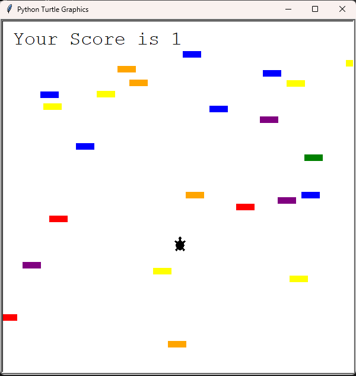
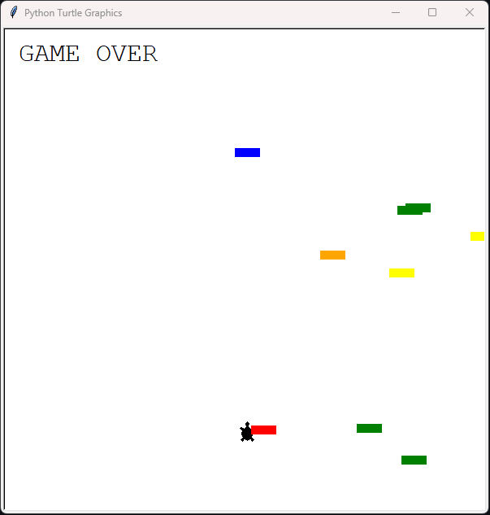

# Road Corssing Game

A classic single-player game built using Python and the Turtle Graphics module. In this game, the player controls a character and navigates it across a busy road while avoiding colliding with cars. This project serves as an excellent learning experience for game development enthusiasts.




---

## Features

- **Single Player Gameplay:** Control a character and navigate it across a busy road while avoiding colliding with cars.
- **Scorekeeping:** Tracks the player's score by counting the number of times the player successfully crosses the road.
- **Speed Increase:** The cars on the road increase in speed as the player progresses, making the game more challenging.
- **Simple Controls:** Use the W and S keys to move the player character forward and backward.

---

## How to Play

1. Clone the repository:
   ```bash
   git clone https://github.com/arpan8925/Turtle_Road_Crossing_Game.git
   ```
2. Navigate to the project directory:
   ```bash
   cd Turtle_Road_Crossing_Game
   ```
3. Run the game:
   ```bash
   python main.py
   ```
4. Use the following controls:
   - **Player**: Use `W` and `S` keys to move forward or backward , and save the character from running vehicles.

---

## Technologies Used

- **Python**: The core programming language.
- **Turtle Graphics**: For creating game graphics and animations.

---

## Project Structure

```
Turtle_Road_Crossing_Game/
│
├── car_manager.py          # Handles, Car speed logics
├── main.py        # The main game loop and initialization
├── player.py    # Implements player instence and it's collision logics
├── scoreboard.py          # The main game score tracker
└── README.md        # Project documentation
```

---

## Contributing

Contributions are welcome! If you have ideas to improve the game or fix any bugs, feel free to fork the repository and submit a pull request.

---

## License

This project is licensed under the [MIT License](./LICENSE).
